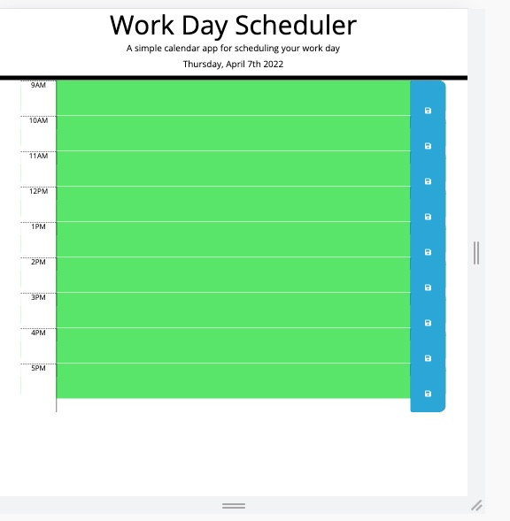

# effective_work_calendar

## Description

    This project was intended to create an effective work day calendar where a user could input events into an hourly time slot schedule. The color would change from past, present, and future based on the current time and the user could see all previously saved appointments, events,or meetings. The intention was to use jQuery, moment.js, and a for loop to solve this problem and create an effective webpage scheduler. I learned a lot about jQuery and local storage however I could not figure out how to get the events to stay persistent and the present colorblock to work.


## Usage
    ```md
    
    ```

## Credits

 https://github.com/fcarroll12/effective_work_calendar
 https://fcarroll12.github.io/effective_work_calendar/